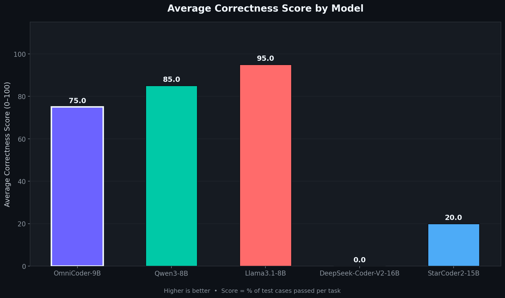
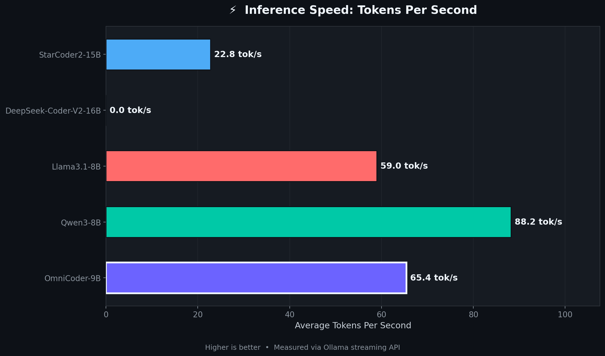
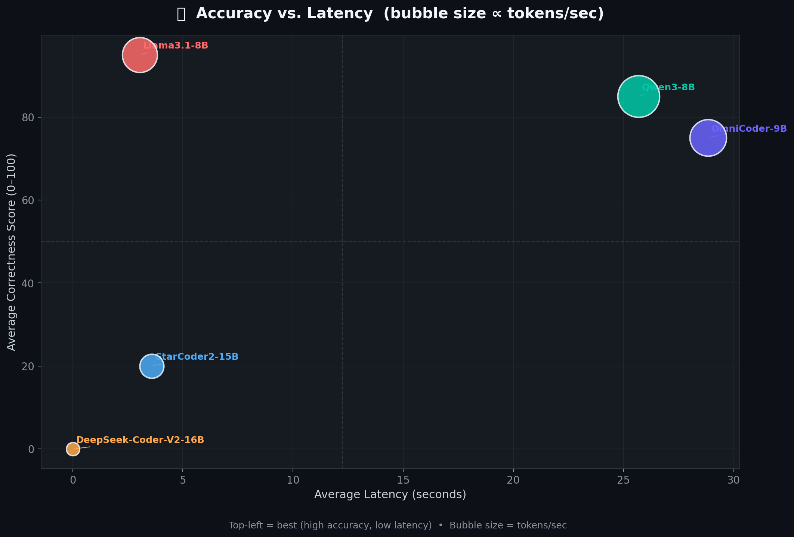
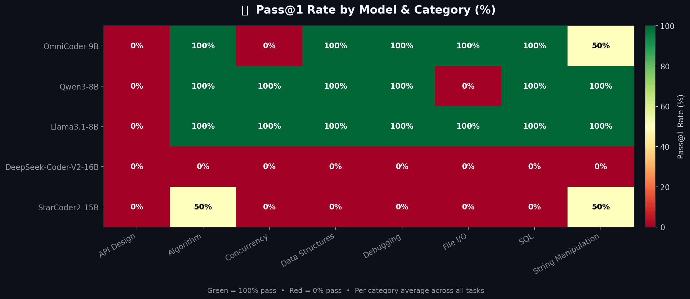
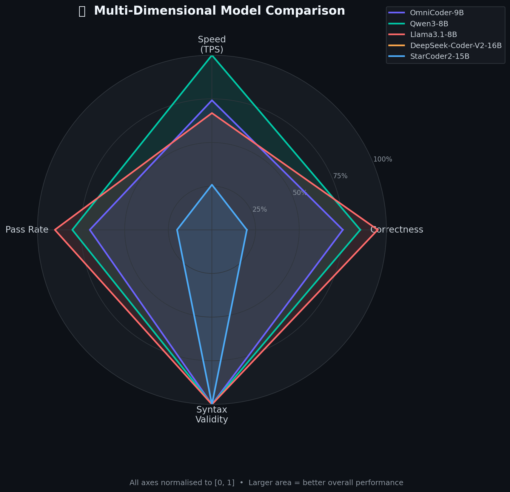

# 🤖 OmniCoder-9B Benchmark — Local Coding LLM Shootout

> **A rigorous, reproducible CLI benchmarking harness** that pits **OmniCoder-9B** against four leading open-source coding models running locally via [Ollama](https://ollama.com). Every metric — correctness, latency, throughput, and syntax validity — is captured automatically across 10 diverse coding tasks.

---

## 📊 Results at a Glance

| Model | Avg Correctness | Pass@1 Rate | Avg Tokens/sec | Avg Latency | Syntax Valid |
|---|---|---|---|---|---|
| 🥇 **Llama3.1-8B** | **95.0** | **90%** | 59.0 tok/s | 3.0 s | 100% |
| 🥈 **Qwen3-8B** | **85.0** | **80%** | 88.2 tok/s | 25.7 s | 100% |
| 🥉 **OmniCoder-9B** | **75.0** | **70%** | 65.4 tok/s | 28.8 s | 100% |
| 4️⃣ **StarCoder2-15B** | 20.0 | 20% | 22.8 tok/s | 3.6 s | 100% |


> **Note:** DeepSeek-Coder-V2-16B returned 500 errors on all tasks — the 16B model exceeds available VRAM on this machine. Qwen3-8B and OmniCoder-9B are both Qwen3-based reasoning models; their higher latency reflects chain-of-thought generation before code output. StarCoder2-15B scored higher than its 7B predecessor but still struggles with this prompt format.

---

## 🖼️ Benchmark Visualisations

### Accuracy — Average Correctness Score


### Speed — Tokens Per Second


### Trade-off — Accuracy vs. Latency


### Coverage — Pass@1 Rate by Category


### Overview — Multi-Dimensional Radar


---

## 🗂️ Project Structure

```
benchmark17/
├── main.py                  # CLI entry point & orchestration engine
├── config.yaml              # Model list, Ollama settings, paths
├── generate_assets.py       # Chart generation script (→ assets/)
├── tasks/                   # 10 JSON task definitions
│   ├── task_01_fibonacci.json
│   ├── task_02_binary_search.json
│   ├── task_03_linked_list.json
│   ├── task_04_string_palindrome.json
│   ├── task_05_word_count.json
│   ├── task_06_file_io.json
│   ├── task_07_concurrency.json
│   ├── task_08_debug.json
│   ├── task_09_sql.json
│   └── task_10_api_design.json
├── results/
│   ├── benchmark_results.json   # Raw per-task results (all models)
│   ├── llm_cache.json           # LLM response cache (avoids re-runs)
│   └── report.html              # Full interactive HTML report
├── assets/                  # Generated PNG charts (this README embeds these)
│   ├── accuracy_scores.png
│   ├── tokens_per_second.png
│   ├── accuracy_vs_latency.png
│   ├── pass_rate_heatmap.png
│   └── radar_comparison.png
└── venv/                    # Python virtual environment
```

---

## ⚙️ Prerequisites

| Requirement | Version |
|---|---|
| Python | ≥ 3.10 |
| [Ollama](https://ollama.com) | ≥ 0.3 |
| NVIDIA GPU (optional) | Any CUDA-capable |

### Pull the models

```bash
ollama pull carstenuhlig/omnicoder-9b
ollama pull qwen3:8b
ollama pull llama3.1:8b
ollama pull deepseek-coder-v2:16b   # requires ~9 GB VRAM
ollama pull starcoder2:15b
```

---

## 🚀 Quick Start

```bash
# 1. Clone the repo
git clone https://github.com/your-username/benchmark17.git
cd benchmark17

# 2. Create & activate virtual environment
python3 -m venv venv
source venv/bin/activate          # Windows: venv\Scripts\activate

# 3. Install dependencies
pip install -r requirements.txt

# 4. Make sure Ollama is running
ollama serve &

# 5. Run the full benchmark
python main.py

# 6. Regenerate charts (optional)
python generate_assets.py
```

The benchmark writes results to `results/benchmark_results.json` and an HTML report to `results/report.html`.

---

## 🔬 Methodology

### Task Suite (10 tasks across 6 categories)

| # | Task | Category | Difficulty | Eval Type |
|---|---|---|---|---|
| 1 | Fibonacci Sequence | Algorithm | Easy | execution |
| 2 | Binary Search | Algorithm | Easy | execution |
| 3 | Linked List Reverse | Data Structures | Medium | execution |
| 4 | String Palindrome Check | String Manipulation | Easy | execution |
| 5 | Word Frequency Count | String Manipulation | Easy | execution |
| 6 | File Line Counter | File I/O | Easy | execution |
| 7 | Thread-Safe Counter | Concurrency | Medium | execution |
| 8 | Debug Buggy Sort | Debugging | Medium | execution |
| 9 | SQL Query Builder | SQL | Medium | execution |
| 10 | REST API URL Parser | API Design | Medium | execution |

### Evaluation Pipeline

```
Prompt → Ollama (streaming) → Code Extraction → AST Validation → Subprocess Sandbox → Metrics
```

1. **Prompt Construction** — Each task JSON defines a natural-language prompt plus typed test cases.
2. **Streaming Inference** — Requests are sent to `http://localhost:11434` via the Ollama REST API with `stream: true`; TTFT and total time are captured token-by-token.
3. **Code Extraction** — The harness strips Markdown fences (` ```python … ``` `) and isolates pure Python.
4. **AST Validation** — `ast.parse()` checks syntax before any execution attempt.
5. **Sandboxed Execution** — Each extracted function is called via `subprocess` with a **10-second timeout** per test case; stdout is compared against the expected output.
6. **Caching** — Raw LLM responses are stored in `results/llm_cache.json`; re-runs skip already-completed model/task pairs.

### Metrics Captured

| Metric | Description |
|---|---|
| `correctness_score` | % of test cases passed (0–100) |
| `latency_ms` | Wall-clock time from first token to last token (ms) |
| `tokens_per_second` | Reported by Ollama streaming (`eval_count / eval_duration`) |
| `response_length` | Number of tokens in the extracted code |
| `syntax_validity` | `True` if `ast.parse()` succeeds without error |
| `pass_at_1` | Boolean — did the model pass **all** test cases on the first attempt? |

---

## 📋 Per-Task Results

### OmniCoder-9B

| Task | Category | Score | Pass@1 | Tokens/s | Latency |
|---|---|---|---|---|---|
| Fibonacci Sequence | Algorithm | 100 | ✅ | 26.4 | 15.1 s |
| Binary Search | Algorithm | 100 | ✅ | 68.1 | 5.1 s |
| Linked List Reverse | Data Structures | 100 | ✅ | 72.2 | 13.2 s |
| String Palindrome Check | String Manipulation | 100 | ✅ | 67.2 | 4.1 s |
| Word Frequency Count | String Manipulation | 0 | ❌ | 73.1 | 112.0 s |
| File Line Counter | File I/O | 100 | ✅ | 67.2 | 5.4 s |
| Thread-Safe Counter | Concurrency | 0 | ❌ | 72.9 | 112.4 s |
| Debug Buggy Sort | Debugging | 100 | ✅ | 65.5 | 4.3 s |
| SQL Query Builder | SQL | 100 | ✅ | 70.9 | 7.3 s |
| REST API URL Parser | API Design | 50 | ❌ | 70.7 | 9.5 s |

### Qwen3-8B

| Task | Category | Score | Pass@1 | Tokens/s | Latency |
|---|---|---|---|---|---|
| Fibonacci Sequence | Algorithm | 100 | ✅ | 45.1 | 41.0 s |
| Binary Search | Algorithm | 100 | ✅ | 94.0 | 8.2 s |
| Linked List Reverse | Data Structures | 100 | ✅ | 92.9 | 5.3 s |
| String Palindrome Check | String Manipulation | 100 | ✅ | 92.0 | 6.5 s |
| Word Frequency Count | String Manipulation | 100 | ✅ | 93.5 | 25.1 s |
| File Line Counter | File I/O | 0 | ❌ | 89.2 | 91.9 s |
| Thread-Safe Counter | Concurrency | 100 | ✅ | 93.5 | 21.6 s |
| Debug Buggy Sort | Debugging | 100 | ✅ | 94.3 | 13.7 s |
| SQL Query Builder | SQL | 100 | ✅ | 93.8 | 14.8 s |
| REST API URL Parser | API Design | 50 | ❌ | 93.5 | 28.8 s |

### Llama3.1-8B

| Task | Category | Score | Pass@1 | Tokens/s | Latency |
|---|---|---|---|---|---|
| Fibonacci Sequence | Algorithm | 100 | ✅ | 2.1 | 21.7 s |
| Binary Search | Algorithm | 100 | ✅ | 71.6 | 1.2 s |
| Linked List Reverse | Data Structures | 100 | ✅ | 48.8 | 0.8 s |
| String Palindrome Check | String Manipulation | 100 | ✅ | 57.3 | 0.6 s |
| Word Frequency Count | String Manipulation | 100 | ✅ | 49.4 | 0.6 s |
| File Line Counter | File I/O | 100 | ✅ | 57.6 | 0.7 s |
| Thread-Safe Counter | Concurrency | 100 | ✅ | 86.9 | 1.8 s |
| Debug Buggy Sort | Debugging | 100 | ✅ | 76.4 | 1.1 s |
| SQL Query Builder | SQL | 100 | ✅ | 66.3 | 0.9 s |
| REST API URL Parser | API Design | 50 | ❌ | 73.1 | 1.1 s |

### StarCoder2-15B

| Task | Category | Score | Pass@1 | Tokens/s | Latency |
|---|---|---|---|---|---|
| Fibonacci Sequence | Algorithm | 0 | ❌ | 0.1 | 30.2 s |
| Binary Search | Algorithm | 100 | ✅ | 57.3 | 1.6 s |
| Linked List Reverse | Data Structures | 0 | ❌ | 14.4 | 0.1 s |
| String Palindrome Check | String Manipulation | 0 | ❌ | 10.5 | 0.2 s |
| Word Frequency Count | String Manipulation | 100 | ✅ | 55.1 | 1.1 s |
| File Line Counter | File I/O | 0 | ❌ | 11.1 | 0.2 s |
| Thread-Safe Counter | Concurrency | 0 | ❌ | 59.9 | 1.9 s |
| Debug Buggy Sort | Debugging | 0 | ❌ | 5.0 | 0.2 s |
| SQL Query Builder | SQL | 0 | ❌ | 5.1 | 0.2 s |
| REST API URL Parser | API Design | 0 | ❌ | 9.2 | 0.2 s |

### DeepSeek-Coder-V2-16B

> All tasks failed with HTTP 500 — model exceeds available VRAM on this machine.

---

## 🔧 Configuration

Edit `config.yaml` to customise models, timeouts, and paths:

```yaml
models:
  - name: "carstenuhlig/omnicoder-9b:latest"
    display_name: "OmniCoder-9B"
    is_primary: true
  - name: "qwen3:8b"
    display_name: "Qwen3-8B"
    is_primary: false
  # Add or remove models freely

ollama:
  base_url: "http://localhost:11434"
  timeout: 120
  stream: true

benchmark:
  tasks_dir: "./tasks"
  results_dir: "./results"
  cache_file: "./results/llm_cache.json"
  execution_timeout: 10   # seconds per test case
  max_retries: 1

report:
  output_file: "./results/report.html"
  title: "OmniCoder-9B vs Competitors: Coding LLM Benchmark"
```

### Adding a Custom Task

Create a new JSON file in `tasks/`:

```json
{
  "id": "task_11",
  "name": "My Custom Task",
  "category": "Algorithm",
  "difficulty": "medium",
  "prompt": "Write a Python function `my_func(x)` that ...",
  "function_name": "my_func",
  "test_cases": [
    {"input": "5",   "expected": "25"},
    {"input": "0",   "expected": "0"}
  ],
  "evaluation_type": "execution"
}
```

---

## 📈 Key Findings

- **Llama3.1-8B** (Meta's successor to CodeLlama) topped the leaderboard at **95.0** correctness / **90% Pass@1** — the fastest and most accurate model in this run at just 3 s avg latency.
- **Qwen3-8B** scored **85.0** with 80% Pass@1 and the highest raw throughput (88.2 tok/s), though its reasoning mode inflated latency on some tasks.
- **OmniCoder-9B** scored **75.0** / 70% Pass@1. As a Qwen3.5 hybrid MoE reasoning model it occasionally exhausts its token budget on harder tasks before emitting code.
- **StarCoder2-15B** improved over the 7B variant — scored 20.0 and passed 2 tasks (Binary Search, Word Count) — but its fill-in-the-middle prompt format remains a mismatch for instruction-style tasks.
- **DeepSeek-Coder-V2-16B** returned 500 Server Errors on all tasks; the 9 GB model exceeds available VRAM on this machine and could not be loaded.

---

## 🛠️ Regenerating the Report & Charts

```bash
# Re-run benchmark (uses cache for already-completed tasks)
python main.py

# Regenerate PNG charts from existing results
python generate_assets.py

# Open the HTML report
open results/report.html        # macOS
xdg-open results/report.html   # Linux
```

---

## 📄 License

MIT — see [LICENSE](LICENSE) for details.

---

## 🙏 Acknowledgements

- [Ollama](https://ollama.com) — local LLM serving made simple
- [OmniCoder-9B](https://huggingface.co/Tesslate/OmniCoder-9B) by Tesslate / Carsten Uhlig (updated Mar 2026)
- [Qwen3-Coder-Next](https://huggingface.co/Qwen) by Alibaba DAMO Academy (Feb 2026)
- [DeepSeek-Coder-V2](https://huggingface.co/deepseek-ai) by DeepSeek AI
- [Llama 3.1](https://huggingface.co/meta-llama) by Meta AI (successor to CodeLlama)
- [StarCoder2](https://huggingface.co/bigcode) by BigCode / HuggingFace

---

*Generated on 2026-03-18 · Benchmark harness v1.0*

---

> This project was autonomously built using **[NEO](https://heyneo.so)** — your autonomous AI agent.
